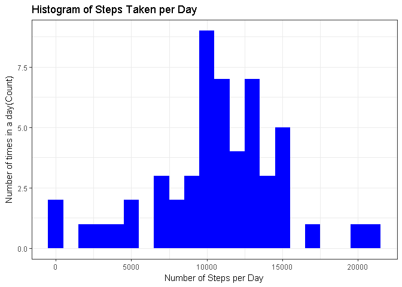
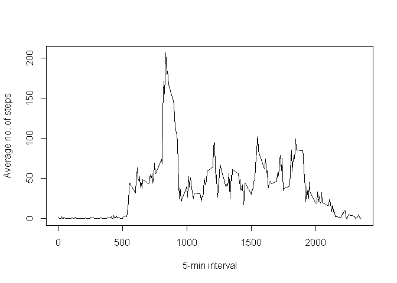
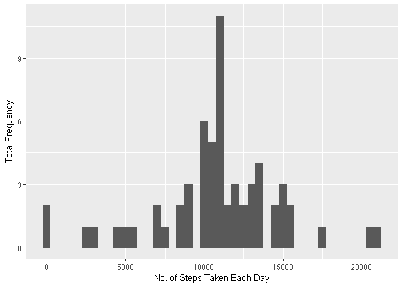
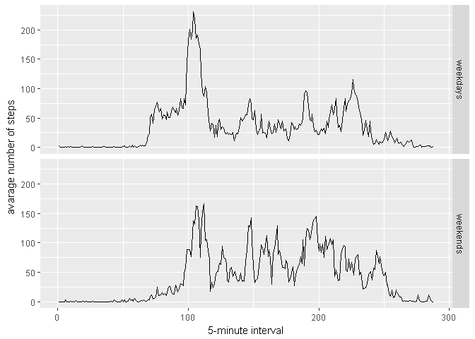

## Introduction
This document represents the results of Reproducible Research Peer Assessment 1 on Coursera. It uses the data from a personal activity monitoring devices which collects data at five (5) minute intervals through out the day. The data consist of thwo (2) months of data from an anonymous individual collected during the months of October and November 2012.


The data for this assignment can be downloaded from the course web site or on this link: (https://d396qusza40orc.cloudfront.net/repdata%2Fdata%2Factivity.zip)


## Preparing the environment
We first set echo equal to **TRUE** and results equal to **'hold'** as a global options for this document.


```r
library(knitr)
```

```
## Warning: package 'knitr' was built under R version 3.4.4
```

```r
opts_chunk$set(echo = TRUE, results = 'hold')
```

###  The required liblaries should be loaded!

```r
library(data.table)
```

```
## Warning: package 'data.table' was built under R version 3.4.4
```

```r
library(ggplot2)
```

```
## Warning: package 'ggplot2' was built under R version 3.4.2
```

```r
# For plotting of figures, ggplot2 would be use
```


### Loading and preprocessing the data
1. Load the data in csv file
2. Process the data into a format suitable for analysis


```r
data <- read.csv('activity.csv', header = TRUE, sep = ",",
                  colClasses=c("numeric", "character", "numeric"))
```

### Pre-process the data
Convert the **date** field to Data class and **interval** field to Factor class.


```r
data$date <- as.Date(data$date, format = "%Y-%m-%d")
data$interval <- as.factor(data$interval)
```


## What is mean total number of steps taken per day?
Assumption: Ignore the missing values.
Calculate the total steps per day.


```r
steps_p_day <- aggregate(steps ~ date, data, sum)
colnames(steps_p_day) <- c("date","steps")
head(steps_p_day)
```

```
##         date steps
## 1 2012-10-02   126
## 2 2012-10-03 11352
## 3 2012-10-04 12116
## 4 2012-10-05 13294
## 5 2012-10-06 15420
## 6 2012-10-07 11015
```


1. Make a histogram of the total number of steps taken each day.
        

```r
ggplot(steps_p_day, aes(x = steps)) + 
       geom_histogram(fill = "blue", binwidth = 1000) + 
        labs(title="Histogram of Steps Taken per Day", 
             x = "Number of Steps per Day", y = "Number of times in a day(Count)") + theme_bw() 
```

<!-- -->

        
2. Calculate the mean and median total number of steps taken per day.
        

```r
steps_mean   <- mean(steps_p_day$steps, na.rm=TRUE)
steps_median <- median(steps_p_day$steps, na.rm=TRUE)
```

The mean is **1.0766189\times 10^{4}** and the median is **1.0765\times 10^{4}**.


## What is the average daily activity pattern?
1. Make a time series plot (i.e. type = "l") of the 5-minute interval (x-axis) and the average number of steps taken, averaged across all days (y-axis).
2. Which 5-minute interval, on average across all the days in the dataset, contains the maximum number of steps?
        

```r
avg<- tapply(data$steps, data$interval, mean, na.rm=TRUE)
plot(names(avg), avg, xlab="5-min interval", type="l", ylab="Average no. of steps")
```

<!-- -->


```r
maxavg<- max(avg)
maxinterval<- as.numeric(names(avg)[which(avg==max(avg))])
```


- The 5 minute interval is 835.
- The Maximum Average Value is 206.1698113.


## Imputing missing values
Note that there are a number of days/intervals where there are missing values (coded as NA). The presence of missing days may introduce bias into some calculations or summaries of the data.

1. Calculate and report the total number of missing values in the dataset (i.e. the total number of rows with NAs)
        

```r
totalna<- sum(is.na(data$steps))
```

- The Total NA's are 2304.

2. Devise a strategy for filling in all of the missing values in the dataset. The strategy does not need to be sophisticated. For example, you could use the mean/median for that day, or the mean for that 5-minute interval, etc.


```r
# creating a copy of data set so that the missing value can be imputed in it
imputedata<- data

# Devise a strategy for filling in all of the missing values in the datase.
# In place of NA, using the mean for that 5-minute interval
imputedata$steps[which(is.na(data$steps))]<- as.vector(avg[as.character(data[which(is.na(data$steps)),3])])
```

3. Create a new dataset that is equal to the original dataset but with the missing data filled in.

4. Make a histogram of the total number of steps taken each day and Calculate and report the mean and median total number of steps taken per day. Do these values differ from the estimates from the first part of the assignment? What is the impact of imputing missing data on the estimates of the total daily number of steps?


```r
stepseachday<- tapply(imputedata$steps, imputedata$date, sum, na.rm=TRUE)
qplot(stepseachday, xlab="No. of Steps Taken Each Day", ylab="Total Frequency", binwidth=500)
```

<!-- -->


```r
medianEachDayImputed<- median(stepseachday)
meanEachDayImputed<- mean(stepseachday)
```

- The Mean Total No. of Steps Taken per Day is 1.0766189\times 10^{4}.
- The Median Total No. of Steps Taken per Day is 1.0766189\times 10^{4}.


## Are there differences in activity patterns between weekdays and weekends?
For this part the weekdays() function may be of some help here. Use the dataset with the filled-in missing values for this part.

1. Create a new factor variable in the dataset with two levels – “weekday” and “weekend” indicating whether a given date is a weekday or weekend day.


```r
imputedata$dayType<- ifelse(as.POSIXlt(imputedata$date)$wday %in% c(0,6), "weekends","weekdays")
```
2. Make a panel plot containing a time series plot.
        

```r
aggregateData<- aggregate(steps ~ interval + dayType, data=imputedata, mean)
ggplot(aggregateData, aes(x=as.numeric(interval), y=steps)) + 
    geom_line() + 
    facet_grid(dayType ~ .) +
    xlab("5-minute interval") + 
    ylab("avarage number of steps")
```

<!-- -->

```r
#ggplot(aggregateData, aes(x=interval, y=steps, group=1)) + 
#    geom_line() + 
#    facet_grid(dayType ~ .) +
 #   xlab("5-minute interval") + 
  #  ylab("avarage number of steps")
```


